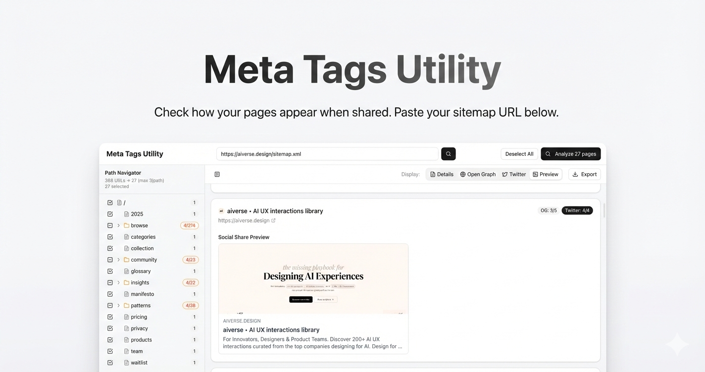

# Meta Tags Utility

**Check how your website pages appear when shared on social media.**

Meta Tags Utility helps you analyze and preview how your web pages look when shared on platforms like Facebook, Twitter, LinkedIn, and messaging apps. Simply paste your sitemap URL, and the tool will check all your pages to show you exactly what people see when they share your links.

## What It Does

- **Preview Social Shares**: See exactly how your pages appear when shared on social media platforms
- **Analyze Multiple Pages**: Process entire sitemaps at once to check all your pages
- **Open Graph & Twitter Cards**: View and verify your Open Graph and Twitter Card meta tags
- **Export Results**: Download your analysis as Excel or JSON files
- **Smart Filtering**: Organize pages by path and filter results to focus on specific sections
- **Visual Previews**: See actual preview cards as they appear on social platforms

## Get Started

1. **Download** the project
2. **Install dependencies**: `npm i`
3. **Run the development server**: `npm run dev`
4. Open [http://localhost:3000](http://localhost:3000) in your browser

If you run into any issues, ask your AI editor to help fix them!

## How to Use

### Step 1: Enter Your Sitemap URL

On the homepage, paste your sitemap URL into the search bar. This can be:
- A sitemap.xml file (e.g., `https://example.com/sitemap.xml`)
- A sitemap index file
- Any valid sitemap URL

Press Enter or click the search button to start.

### Step 2: Review Your Pages

Once your sitemap is loaded, you'll see:
- **Left Sidebar**: A tree view of all your pages organized by path
- **Page Count**: Shows how many pages were found and how many are selected
- **Limit Control**: Adjust how many pages to show per path section (default: 3)

### Step 3: Select Pages to Analyze

- Use checkboxes in the sidebar to select specific pages or sections
- Click "Select All" or "Deselect All" to manage your selection
- The selected count updates automatically

### Step 4: Analyze Meta Tags

Click the **"Analyze X pages"** button (initially shown in the center, then moves to the header) to start checking your meta tags. The tool will:
- Fetch each page
- Extract meta tag information
- Show progress as it works through your pages

### Step 5: View Results

Once analysis is complete, you can:

- **Switch Views**: Use the tabs to see different aspects:
  - **Details**: Basic meta tag information
  - **Open Graph**: Open Graph tags for Facebook, LinkedIn, etc.
  - **Twitter**: Twitter Card tags
  - **Preview**: Visual preview of how the page appears when shared

- **Filter by Path**: Click on a path in the sidebar to see only pages from that section

- **Export Data**: Click the Export button to download results as:
  - **Excel** (.csv) - For spreadsheet analysis
  - **JSON** - For programmatic use

### Understanding the Results

Each page shows:
- **Success/Failure Status**: Whether the page loaded successfully
- **Meta Tag Information**: All relevant tags found on the page
- **Social Preview**: A visual card showing how it looks when shared
- **Completeness Indicators**: Shows how many Open Graph and Twitter tags are present (e.g., "OG: 3/5" means 3 out of 5 recommended tags)

## Features

### Smart Path Organization
Pages are automatically organized by their URL paths, making it easy to navigate large sitemaps. You can expand or collapse sections to focus on specific areas of your site.

### Batch Processing
The tool processes pages in batches to handle large sitemaps efficiently. You'll see a progress bar indicating how many pages have been analyzed.

### Responsive Design
Works seamlessly on desktop, tablet, and mobile devices. The interface adapts to your screen size.

### Dark Mode Support
Automatically respects your system's dark mode preference for comfortable viewing in any lighting condition.

## Tips for Best Results

1. **Start Small**: If you have a large sitemap, consider analyzing specific sections first to understand the results
2. **Check Preview Tab**: The Preview tab shows exactly how your pages will appear - this is often the most useful view
3. **Use Path Filtering**: Focus on specific sections of your site by clicking paths in the sidebar
4. **Export for Review**: Export results to Excel for easy sharing with your team or for documentation

## Technical Details

- Built with [Next.js](https://nextjs.org)
- Uses Framer Motion for smooth animations
- Supports all standard meta tag formats
- Works with any sitemap that follows the sitemap.xml protocol

## Troubleshooting

**Can't load sitemap?**
- Make sure the URL is correct and publicly accessible
- Check that the sitemap follows the standard XML format
- Try accessing the sitemap URL directly in your browser first

**Pages not loading?**
- Some pages may require authentication or have CORS restrictions
- Check the error count in the results to see which pages failed
- Failed pages are marked with an error indicator

**Need help?**
Ask your AI editor - they can help troubleshoot any issues you encounter!

## License

This project is open source and available for use and modification.
